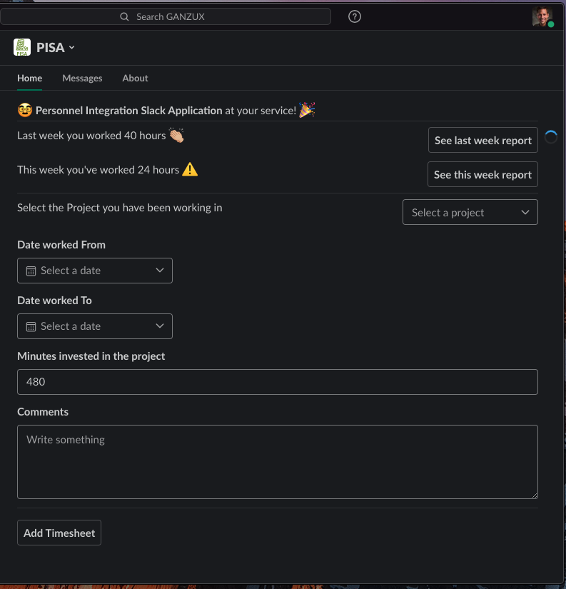
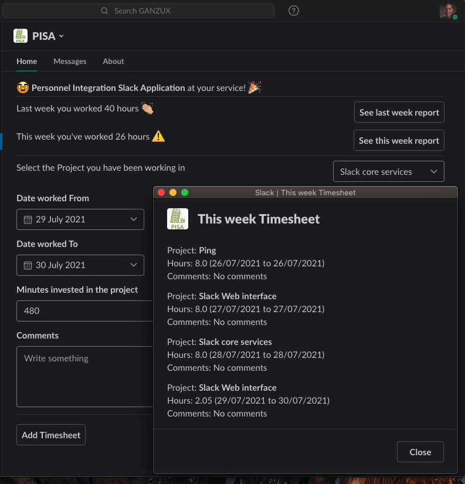

[![Contributors][contributors-shield]][contributors-url]
[![Forks][forks-shield]][forks-url]
[![Stargazers][stars-shield]][stars-url]
[![Issues][issues-shield]][issues-url]
[![Commit Activity][git-activity-shield]][git-activity-url]
[![Last Commit][git-commit-shield]][git-commit-url]
[![MIT License][license-shield]][license-url]
[![Heroku][heroku-shield]][heroku-url]
[![LinkedIn][linkedin-shield]][linkedin-url]


ganzux/pisa-slack

<br />
<p align="center">
  <a href="https://github.com/ganzux/pisa-slack">
    
  </a>

  <h3 align="center">PISA</h3>

  <p align="center">
    Personnel Integration Slack Application
    <br />
    <a href="https://github.com/ganzux/pisa-slack"><strong>Explore the docs »</strong></a>
    <br />
    <br />
    <a href="https://sirme-slack.herokuapp.com/actuator/health">View Demo</a>
    ·
    <a href="https://github.com/ganzux/pisa-slack/issues">Report Bug</a>
    ·
    <a href="https://github.com/ganzux/pisa-slack/issues">Request Feature</a>
  </p>
</p>


<!-- TABLE OF CONTENTS -->
<details open="open">
  <summary><h2 style="display: inline-block">Table of Contents</h2></summary>
  <ol>
    <li>
      <a href="#about-the-project">About The Project</a>
      <ul>
        <li><a href="#built-with">Built With</a></li>
        <li><a href="#todo-list">TODO List</a></li>
      </ul>
    </li>
    <li>
      <a href="#getting-started">Getting Started</a>
      <ul>
        <li><a href="#prerequisites">Prerequisites</a></li>
        <li><a href="#installation">Installation</a></li>
      </ul>
    </li>
    <li><a href="#screenshots">Screenshots</a></li>
    <li><a href="#contributing">Contributing</a></li>
    <li><a href="#license">License</a></li>
    <li><a href="#contact">Contact</a></li>
    <li><a href="#acknowledgements">Acknowledgements</a></li>
  </ol>
</details>


<!-- ABOUT THE PROJECT -->
## About The Project

PISA is your personnal assistant for HR interactions within SLACK!




### Built With

* [Java](https://en.wikipedia.org/wiki/Java_(programming_language)): Java is a high-level, class-based, object-oriented 
programming language that is designed to have as few implementation dependencies as possible.

* [SpringBoot](https://spring.io/projects/spring-boot): Spring Boot makes it easy to create stand-alone, 
production-grade Spring based Applications that you can "just run".

* [Slack](https://www.slack.com/): Slack is a new way to communicate with your team. It's faster, better organized, 
and more secure than email.

* [Slack Bolt](https://slack.dev/java-slack-sdk/): a foundational framework for Slack apps.

* [ngrock](https://ngrok.com/): ngrok provides a real-time web UI where you can introspect all HTTP traffic running 
over your tunnels. Replay any request against your tunnel with one click.

* [Heroku](https://id.heroku.com/login): Heroku is a platform as a service (PaaS) that enables developers to build, 
run, and operate applications entirely in the cloud.


### TODO List

1. Decouple into a Data microservice and a services microservice
2. TESTS!
3. Introduce Mappers for DTO/Data Objects
4. Flyway for migrations in DB
5. Default Dates in main screen
6. Refresh main screen after recording a TS
7. Integrate with commands
8. Default project - Last one used
9. Translate
10. ...

<!-- GETTING STARTED -->
## Getting Started

To get a local copy up and running follow these simple steps.

### Prerequisites

This is an example of how to list things you need to use the software and how to install them.
* maven
* Java 1.8+
* ngrok

### Installation

1. Clone the repo
   ```sh
   git clone https://github.com/ganzux/pisa-slack.git
   ```
2. Build the project
   ```sh
   mvn package
   ```
3. Start a ngrock instance
   ```sh
   ./ngrok http 3000
   ```
4. Point your SLACK app to the HTTPS url provided by ngrok
   ```
   https://17de9bbc1338.ngrok.io -> http://localhost:3000
   ```
5. Start your SpringBoot App in the port 3000
    ```sh
    mvn spring-boot:run 
   ```


<!-- SCREENSHOTS -->
## Screenshots




<!-- CONTRIBUTING -->
## Contributing

Contributions are what make the open source community such an amazing place to be learn, inspire, and create. Any contributions you make are **greatly appreciated**.

1. Fork the Project
2. Create your Feature Branch (`git checkout -b feature/AmazingFeature`)
3. Commit your Changes (`git commit -m 'Add some AmazingFeature'`)
4. Push to the Branch (`git push origin feature/AmazingFeature`)
5. Open a Pull Request


<!-- LICENSE -->
## License

Distributed under the MIT License. See `LICENSE` for more information.


<!-- CONTACT -->
## Contact

Your Name - [@ganzux](https://twitter.com/ganzux) - email

Project Link: [https://github.com/ganzux/pisa-slack](https://github.com/ganzux/pisa-slack)


<!-- MARKDOWN LINKS & IMAGES -->
<!-- https://www.markdownguide.org/basic-syntax/#reference-style-links -->
[contributors-shield]: https://img.shields.io/github/contributors/ganzux/pisa-slack?style=for-the-badge
[contributors-url]: https://github.com/ganzux/pisa-slack/graphs/contributors

[forks-shield]: https://img.shields.io/github/forks/ganzux/pisa-slack?style=for-the-badge
[forks-url]: https://github.com/ganzux/pisa-slack/network/members

[stars-shield]: https://img.shields.io/github/stars/ganzux/pisa-slack?style=for-the-badge
[stars-url]: https://github.com/ganzux/pisa-slack/stargazers

[issues-shield]: https://img.shields.io/github/issues/ganzux/pisa-slack?style=for-the-badge
[issues-url]: https://github.com/ganzux/pisa-slack/issues

[license-shield]: https://img.shields.io/github/license/ganzux/pisa-slack?style=for-the-badge
[license-url]: https://github.com/ganzux/pisa-slack/blob/master/LICENSE.txt

[linkedin-shield]: https://img.shields.io/badge/-LinkedIn-black.svg?style=for-the-badge&logo=linkedin&colorB=555
[linkedin-url]: https://www.linkedin.com/in/alvaroam

[heroku-shield]: https://img.shields.io/badge/%E2%86%91_Deploy_to-Heroku-7056bf.svg?style=for-the-badge
[heroku-url]: https://sirme-slack.herokuapp.com/

[git-activity-shield]: https://img.shields.io/github/commit-activity/y/ganzux/pisa-slack?style=for-the-badge
[git-activity-url]: https://github.com/ganzux/pisa-slack/branches

[git-commit-shield]: https://img.shields.io/github/last-commit/ganzux/pisa-slack?style=for-the-badge
[git-commit-url]: https://github.com/ganzux/pisa-slack/commits/master
